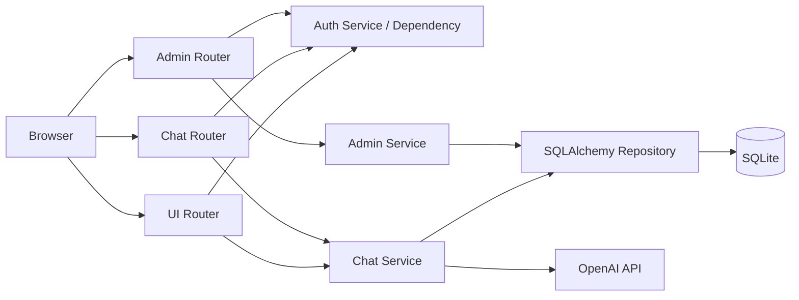
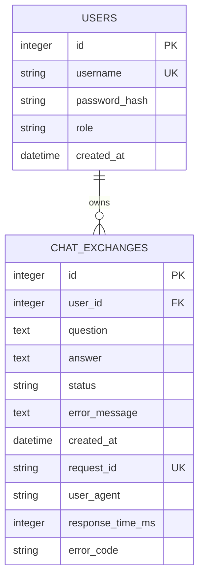

# Codyssey B7-1 AI Chatbot

FastAPI, SQLite, OpenAI API를 하나의 web application으로 통합한 사용자별 AI chatbot입니다.

## 프로젝트 목적과 문제 정의

일회성 AI 질문 도구는 사용자를 구분하지 않으면 대화 문맥과 기록이 섞이고, 응답 실패 원인을 추적하기 어렵습니다. 이 프로젝트는 로그인한 사용자별로 질문·답변과 처리 상태를 분리해 저장하여, 본인 대화의 연속성과 운영 추적 가능성을 함께 제공합니다.

핵심 사용자 흐름은 **로그인 → 질문 입력 → AI 응답 표시 → 내 대화 로그 조회**입니다. 로그인 사용자가 질문하면 server가 최근 대화 문맥과 함께 OpenAI API를 호출하고 결과를 저장하며, 사용자는 같은 Chat 화면 또는 본인 기록 API에서 누적된 대화를 확인합니다.

## 주요 기능과 구현 상태

| 기능 | 상태 | 설명 |
| --- | --- | --- |
| Auth domain | 구현 | User, 회원가입·login Service, password hash·검증, session helper, 관리자 권한 검사 |
| Chat JSON API | 구현 | 질문 검증, 최근 성공 대화 최대 5건의 문맥 구성, OpenAI 호출, 성공·실패 저장 |
| 내 대화 기록 API | 구현 | 로그인 사용자의 전체 기록 및 단일 기록을 소유권 조건으로 조회 |
| 관리자 운영 기록 | 구현 | 관리자만 `/admin/logs`에서 안전한 운영 metadata를 읽기 전용으로 조회 |
| Login·회원가입 UI | 구현 | `/signup`, `/login`, `/logout` form route와 server-rendered template |
| Chat UI | 구현 | `/chat` history rendering, 질문 전송 JavaScript, 오류·Loading 상태 처리 |
| Railway 배포 | 구현 | [Public HTTPS service](https://codyssey-b7-1-production.up.railway.app), persistent SQLite Volume, health smoke test |

## 기술 구성

- Python 3.11+
- FastAPI, Uvicorn, Jinja2
- SQLAlchemy, SQLite
- OpenAI Python SDK
- Pydantic Settings
- pytest, Ruff, Pyright

## 시작하기

### 1. Dependency 설치

[`uv`](https://docs.astral.sh/uv/)가 설치된 환경에서 다음 명령을 실행합니다.

```bash
uv sync
```

### 2. Environment variable 설정

```bash
cp .env.example .env
```

`.env`에서 실제 값을 입력합니다. `.env`는 `.gitignore`에 포함되어 있으므로 commit하지 않습니다.

`OPENAI_API_KEY`는 server 설정에서만 읽어 OpenAI API 요청에 사용합니다. Browser·frontend code와 API response에는 key를 포함하거나 노출하지 않습니다.

| 이름 | `.env.example` 값·기본값 | 설명 |
| --- | --- | --- |
| `SESSION_SECRET` | 없음 | Signed session cookie용 secret. 실행 시 필수 |
| `OPENAI_API_KEY` | 없음 | OpenAI API 인증 secret. Chat 사용 시 필수 |
| `OPENAI_MODEL` | `gpt-5-nano` | 답변 생성 model |
| `OPENAI_TIMEOUT_SECONDS` | `30` | OpenAI request timeout |
| `DATABASE_URL` | `sqlite:///./data/chatbot.db` | Local SQLAlchemy DB 연결 URL. Production에서는 명시적 설정 필수 |
| `APP_ENV` | `local` | `local` 또는 `production` |
| `LOG_LEVEL` | `INFO` | Application log level |
| `ADMIN_USERNAME` | `admin` | 초기 관리자 username |
| `ADMIN_INITIAL_PASSWORD` | 없음 | 관리자 역할 계정이 없는 DB의 최초 실행 시 필수 |
| `PORT` | 없음 | Railway Variables에서 직접 설정하는 HTTP server port |

### 3. Application 실행

```bash
uv run uvicorn app.main:app --reload
```

기본 주소는 `http://127.0.0.1:8000`입니다. Browser에서 `/signup` 또는 `/login`으로 사용자 흐름을 시작하고, process 상태는 `GET /health`로 확인합니다.

```bash
curl http://127.0.0.1:8000/health
```

```json
{"status":"ok"}
```

### 4. Railway 배포와 확인

Production에서는 `APP_ENV=production`, `DATABASE_URL=sqlite:////data/chatbot.db`와 secret을 Railway Variables에 명시하고, Volume을 `/data`에 mount합니다. PR #46부터 production에서 `DATABASE_URL`을 직접 설정하지 않으면 ephemeral SQLite file로 fallback하지 않고 application 시작을 거부합니다.

```bash
uv run uvicorn app.main:app --host 0.0.0.0 --port $PORT
```

- 배포 URL: [https://codyssey-b7-1-production.up.railway.app](https://codyssey-b7-1-production.up.railway.app)
- Healthcheck: `GET /health`
- Process smoke test: 2026-08-11 외부 network에서 `GET /health`의 `{"status":"ok"}` 응답 확인

자세한 Railway Variables와 persistent Volume 구성은 [`docs/spec/DEPLOYMENT.md`](docs/spec/DEPLOYMENT.md)를 참고합니다.

## Architecture

Application은 하나의 FastAPI process 안에서 책임별 module을 분리한 modular monolith입니다. 기본 의존 방향은 `Main·Router → Service → Repository → Core`입니다.



### 파일별 역할

| 파일·디렉토리 | 역할 |
| --- | --- |
| `app/main.py` | FastAPI application 생성, Session·Request ID middleware와 exception handler 설정, Chat·Admin·UI router 등록, `/static` mount, DB table·초기 관리자 준비, `/health` 등록 |
| `app/core/config.py` | Environment variable loading, type 변환과 environment별 validation |
| `app/core/database.py` | SQLAlchemy `Base`, engine, `SessionLocal`, 요청별 DB session과 table 초기화 |
| `app/core/security.py` | PBKDF2-SHA256 password hash와 constant-time 검증 |
| `app/core/request_id.py` | 요청별 UUID 생성, `request.state`와 `X-Request-ID` 연결 |
| `app/auth/models.py` | `users` ORM model과 user·admin 역할 정의 |
| `app/auth/repository.py` | User 생성·조회와 관리자 계정 조회 |
| `app/auth/service.py` | 회원가입, login 인증, 초기 관리자 bootstrap과 transaction 처리 |
| `app/auth/dependencies.py` | Session user ID helper, JSON API 로그인 검사, 관리자 권한 검사 |
| `app/chat/router.py` | Chat·본인 기록 JSON endpoint와 공통 JSON 오류 응답 |
| `app/chat/schemas.py` | Chat request·response와 오류 Pydantic schema |
| `app/chat/service.py` | 입력 검증, 사용자 문맥 조회, OpenAI 호출, 성공·실패 기록 transaction |
| `app/chat/context.py` | System prompt와 최근 성공 대화를 OpenAI message로 구성 |
| `app/chat/openai_client.py` | OpenAI SDK adapter, model·timeout 적용, API 오류 변환 |
| `app/chat/models.py` | `chat_exchanges` ORM model과 DB constraint |
| `app/chat/repository.py` | 사용자별 ChatExchange 저장·조회 query |
| `app/admin/router.py` | 관리자 전용 `/admin/logs` HTML route와 접근 제어 연결 |
| `app/admin/service.py`, `app/admin/repository.py` | 관리자 화면용 안전한 운영 metadata projection과 read-only query |
| `app/ui/router.py` | Login·회원가입·logout form 처리, session 생성·삭제, 본인 Chat history rendering |
| `app/ui/templates/` | 회원가입·Login·Chat·관리자 화면과 공통 base·navigation template |
| `app/ui/static/` | 공통 responsive style, Chat interaction, Browser history 복원 처리와 favicon |
| `scripts/check_logs.sql` | 사용자 역할, 최근·실패 대화, 사용자별 건수와 운영 metadata 검증 query |

### Router 책임과 endpoint

| 영역 | Router 책임 | 담당 endpoint | 상태 |
| --- | --- | --- | --- |
| `app/auth` | Auth는 HTTP router를 두지 않고 User·session·권한 domain interface를 제공합니다. Browser Auth form은 UI Router가 Auth Service를 호출하는 구조입니다. | 직접 소유 endpoint 없음 | Domain 구현 |
| `app/chat/router.py` | 로그인 사용자 ID와 DB session을 Chat Service에 전달하고 결과·오류를 JSON으로 변환합니다. | `POST /api/chat`, `GET /api/chat-exchanges`, `GET /api/chat-exchanges/{chat_exchange_id}` | 구현 |
| `app/admin/router.py` | 관리자 권한을 확인하고 운영 metadata를 HTML로 rendering합니다. | `GET /admin/logs` | 구현 |
| `app/ui/router.py` | Auth form 처리, session 생성·삭제, 본인 대화 기록과 Chat 화면 rendering을 담당합니다. | `GET /`, `GET·POST /signup`, `GET·POST /login`, `POST /logout`, `GET /chat` | 구현 |
| `app/main.py` | Process health 확인 endpoint를 등록합니다. | `GET /health` | 구현 |

Static asset은 `app/main.py`에서 `/static`에 mount하며 모든 화면이 공통 CSS를, Chat 화면이 Chat JavaScript를 사용합니다.

## 인증과 비로그인 접근 제한

비로그인 접근 제한 대상은 `/chat`, `POST /api/chat`, 두 `/api/chat-exchanges...` 조회 API와 `/admin/logs`입니다. `/`는 인증 상태에 따라 `/chat` 또는 `/login`으로 이동하며, `/health`, `/signup`, `/login`, `/logout`, `/static/{path}`는 인증 없이 접근할 수 있습니다. `/logout`은 session 유무와 관계없이 session data를 제거하고 `/login`으로 이동하며, `/admin/logs`는 로그인 외에 `users.role=admin` 권한도 필요합니다.

대화에는 사용자 질문·답변이라는 개인별 정보가 저장되고, AI 호출은 외부 API 비용과 남용 위험을 발생시키므로 사용자 식별과 소유권 검사가 필요합니다. 따라서 비로그인 사용자의 질문·기록 접근을 차단해 다른 사용자의 기록 노출을 막고, 요청을 책임 있는 사용자와 연결하는 것을 보안·운영 정책의 근거로 삼습니다.

### 회원가입 처리 흐름

회원가입 form의 `POST /signup` 요청은 username 공백을 정리한 뒤 Auth Service로 전달됩니다. Service는 username·password와 중복 username을 검증하고, 통과하면 password hash를 적용한 User를 생성해 DB transaction으로 저장한 뒤 `/login`으로 이동시킵니다. 입력 검증 또는 중복 username이면 안전한 오류 메시지를 같은 form에 표시하며, DB 오류가 발생하면 transaction을 rollback합니다.

인증은 JWT가 아닌 Starlette의 signed session cookie를 사용합니다. Session에는 사용자 ID만 저장하며 만료 시간은 8시간이고, cookie에는 `HttpOnly`, `SameSite=Lax`, production 환경의 `Secure` 설정을 적용합니다.

### 세션·토큰 인증 방식 선택

현재는 same-origin Browser form과 server-rendered UI가 중심이므로, client에 bearer token을 별도로 보관하지 않는 signed session cookie를 선택했습니다. Session에는 최소한의 사용자 ID만 넣고 요청마다 DB User를 대조해 logout과 삭제된 User의 접근을 즉시 반영합니다.

향후 mobile app·외부 client처럼 cross-origin 또는 stateless API 인증이 필요해지면 JWT access token과 refresh token 방식을 도입할 수 있습니다. 이때 access token은 짧은 만료 시간으로 발급하고 `issuer`·`audience`·서명 algorithm·만료 시간을 검증하며, refresh token은 안전한 storage와 rotation 정책으로 관리합니다.

보호된 HTML route와 JSON API는 session의 사용자 ID를 실제 DB User와 대조합니다. User가 삭제된 stale session은 즉시 제거하며, HTML route는 `/login`으로 이동하고 JSON API는 Chat·OpenAI 처리 전에 `401 not_authenticated`를 반환합니다.

## API

### 현재 구현 endpoint

| Method | Path | 인증 | Request | Success response |
| --- | --- | --- | --- | --- |
| `GET` | `/` | 상태 확인 | 없음 | `303 /chat` 또는 `303 /login` |
| `GET` | `/signup` | 상태 확인 | 없음 | 비로그인 `200 text/html` · 로그인 `303 /chat` |
| `POST` | `/signup` | 불필요 | Form `username`, `password` | `303 /login` |
| `GET` | `/login` | 상태 확인 | 없음 | 비로그인 `200 text/html` · 로그인 `303 /chat` |
| `POST` | `/login` | 불필요 | Form `username`, `password` | `303 /chat` |
| `POST` | `/logout` | 상태 무관 | Form 제출 | `303 /login` |
| `GET` | `/chat` | 필수 | 없음 | `200 text/html` |
| `POST` | `/api/chat` | 필수 | JSON body `{"message": string}` | `200 ChatResponse` |
| `GET` | `/api/chat-exchanges` | 필수 | 없음 | `200 ChatExchangeResponse[]` |
| `GET` | `/api/chat-exchanges/{chat_exchange_id}` | 필수 | Integer path parameter | `200 ChatExchangeResponse` |
| `GET` | `/admin/logs` | 관리자 | 없음 | `200 text/html` |
| `GET` | `/static/{path}` | 불필요 | Static asset path | `200 static asset` |
| `GET` | `/health` | 불필요 | 없음 | `200 {"status":"ok"}` |

보호된 API 예시는 Login form에서 생성한 유효한 signed session cookie가 있다는 전제입니다. Browser Chat 화면은 같은 session으로 `POST /api/chat`을 호출하고 성공한 교환을 화면 아래에 이어 붙입니다.

### 질문 생성 요청

`message`는 필수 문자열이며, 앞뒤 공백을 제거한 결과가 1~1000자여야 합니다.

```http
POST /api/chat HTTP/1.1
Content-Type: application/json
Accept-Language: ko
Cookie: session=<signed-session>

{"message":"FastAPI의 장점을 설명해주세요."}
```

성공 응답의 실제 JSON 형식은 다음과 같습니다.

```http
HTTP/1.1 200 OK
X-Request-ID: 6eea8bb1-9231-49cf-8f15-b7becd5f7614
```

```json
{
  "chat_exchange_id": 15,
  "answer": "FastAPI는 Python 기반의 웹 프레임워크입니다.",
  "created_at": "2026-08-04T06:00:00Z"
}
```

비로그인 실패 응답의 실제 JSON 형식은 다음과 같습니다.

```http
HTTP/1.1 401 Unauthorized
```

```json
{
  "code": "not_authenticated",
  "detail": "로그인이 필요합니다."
}
```

Request body의 `message`가 누락되거나 자료형이 다르면 다음 형식으로 응답합니다.

```http
HTTP/1.1 422 Unprocessable Entity
```

```json
{
  "code": "validation_error",
  "detail": "요청 형식이 올바르지 않습니다."
}
```

### 내 대화 기록 조회

```http
GET /api/chat-exchanges HTTP/1.1
Cookie: session=<signed-session>
```

```json
[
  {
    "chat_exchange_id": 15,
    "question": "FastAPI의 장점을 설명해주세요.",
    "answer": "FastAPI는 Python 기반의 웹 프레임워크입니다.",
    "status": "success",
    "created_at": "2026-08-04T06:00:00Z"
  }
]
```

`GET /api/chat-exchanges/{chat_exchange_id}`는 로그인 사용자가 소유한 한 건만 같은 field로 반환합니다. Record가 없거나 다른 사용자의 record이면 둘을 구분하지 않고 다음처럼 응답합니다.

```json
{
  "code": "conversation_not_found",
  "detail": "대화 기록을 찾을 수 없습니다."
}
```

모든 JSON 오류는 `{"code":"...","detail":"..."}` 형식이며 주요 상태는 다음과 같습니다.

| HTTP status | `code` | 상황 |
| --- | --- | --- |
| `400` | `validation_error` | 공백 질문 또는 1000자 초과 |
| `401` | `not_authenticated` | 로그인 session 없음 |
| `404` | `conversation_not_found` | 기록 없음 또는 다른 사용자 소유 |
| `422` | `validation_error` | 필드 누락, 잘못된 자료형·JSON |
| `500` | `db_save_error`, `internal_error` | DB 저장 실패 또는 내부 오류 |
| `502` | `openai_api_error` | OpenAI API 오류 |
| `504` | `openai_timeout` | OpenAI request timeout |

자세한 계약은 [`docs/spec/api/API.md`](docs/spec/api/API.md)를 참고합니다.

## Database

평가 항목에서 말하는 **conversations table**은 이 프로젝트에서 질문과 답변 한 쌍을 뜻하는 실제 table **`chat_exchanges`**로 구현되어 있습니다. 사용자마다 하나의 연속 Chat을 제공하므로 별도 conversation room과 message table로 나누지 않았습니다.



### `chat_exchanges` field

| Field | Type | 조건·역할 |
| --- | --- | --- |
| `id` | Integer | PK, API의 `chat_exchange_id` |
| `user_id` | Integer | FK → `users.id`, Not Null |
| `question` | Text | 사용자가 입력한 질문, Not Null |
| `answer` | Text | 성공한 AI 답변, 실패 시 Null |
| `status` | String(20) | `success` 또는 `failed`, Not Null |
| `error_message` | Text | 실패 시 안전한 내부 요약, 성공 시 Null |
| `created_at` | DateTime | UTC 생성 시각, Not Null |
| `request_id` | String(64) | HTTP response·server log와 연결하는 Unique ID, Not Null |
| `user_agent` | String(512) | 선택적 운영 metadata |
| `response_time_ms` | Integer | 0 이상의 처리 시간(ms), Not Null |
| `error_code` | String(50) | 실패 원인 code, 성공 시 Null |

성공 record는 `answer IS NOT NULL`, `error_message IS NULL`, `error_code IS NULL`이고, 실패 record는 그 반대 조합을 DB `CheckConstraint`로 보장합니다. 자세한 schema와 조회 정책은 [`docs/spec/db/DB.md`](docs/spec/db/DB.md)를 참고합니다.

## 대화 기록 SQL 조회

Application DB 경로는 `.env`의 `DATABASE_URL`로 지정합니다.

```dotenv
DATABASE_URL=sqlite:///./data/chatbot.db
```

기본 상대 경로 DB에 `scripts/check_logs.sql`을 실행합니다.

```bash
sqlite3 data/chatbot.db < scripts/check_logs.sql
```

다른 위치의 DB를 사용할 때는 SQLAlchemy URL과 `sqlite3` file path를 같은 위치로 맞춥니다. 예를 들어 `.env`에 다음처럼 절대 경로를 설정했다면,

```dotenv
DATABASE_URL=sqlite:////data/chatbot.db
```

실제 script 실행 명령은 URL이 아닌 SQLite file path를 사용합니다.

```bash
sqlite3 /data/chatbot.db < scripts/check_logs.sql
```

Local custom DB의 예시는 다음과 같습니다.

```bash
sqlite3 /absolute/path/to/chatbot.db < scripts/check_logs.sql
```

Script는 사용자 역할, 최근 ChatExchange 20건, 실패 record 불변식, 사용자별 대화 수, 운영 metadata와 Admin 9-field projection을 순서대로 출력합니다. `password_hash`, 질문·답변 원문, cookie와 secret은 운영 확인 출력에서 제외합니다.

질문 처리마다 저장되는 `status`, `error_code`, `response_time_ms`, `request_id`와 선택적 `user_agent`는 개인정보 원문 없이 운영 log로 활용합니다. 운영자는 실패 유형·응답 지연·요청 ID를 기준으로 장애를 추적하고, 사용자별 사용량과 실패 추이를 점검해 안정성 개선 우선순위를 정합니다.

## 팀 구성과 담당 작업

담당 범위는 Architecture의 module 소유권과 실제 Git·PR 이력을 함께 기준으로 정리했습니다.

| 구성원 | GitHub | 담당 기능 | 현재 작업과 증빙 |
| --- | --- | --- | --- |
| 김대웅 | [`Daeung-03`](https://github.com/Daeung-03) | `app/main.py`, Auth, request ID, password·session 보안 | User·Auth 기반 [#4](https://github.com/wilderif/codyssey-b7-1/pull/4)·[#17](https://github.com/wilderif/codyssey-b7-1/pull/17), 회원가입·login Service [#19](https://github.com/wilderif/codyssey-b7-1/pull/19)·[#24](https://github.com/wilderif/codyssey-b7-1/pull/24), application·session 조립 [#25](https://github.com/wilderif/codyssey-b7-1/pull/25)·[#34](https://github.com/wilderif/codyssey-b7-1/pull/34), Frontend UI 구현 계약 [#36](https://github.com/wilderif/codyssey-b7-1/pull/36) |
| 이상헌 | [`shannonlee-dev`](https://github.com/shannonlee-dev) | Chat, Admin, DB·Config, AI 연동 | DB 기반 [#1](https://github.com/wilderif/codyssey-b7-1/pull/1)·[#2](https://github.com/wilderif/codyssey-b7-1/pull/2)·[#6](https://github.com/wilderif/codyssey-b7-1/pull/6), Chat 문맥·Service·API [#7](https://github.com/wilderif/codyssey-b7-1/pull/7)·[#9](https://github.com/wilderif/codyssey-b7-1/pull/9)·[#18](https://github.com/wilderif/codyssey-b7-1/pull/18), Admin·log 조회 [#21](https://github.com/wilderif/codyssey-b7-1/pull/21)·[#23](https://github.com/wilderif/codyssey-b7-1/pull/23)·[#26](https://github.com/wilderif/codyssey-b7-1/pull/26), Production Config·JSON Auth hardening과 evaluation test [#46](https://github.com/wilderif/codyssey-b7-1/pull/46) |
| 김우종 | [`wilderif`](https://github.com/wilderif) | UI/FE, 화면 계약, 실행·배포 문서 | Project scaffold·개발 도구 [#8](https://github.com/wilderif/codyssey-b7-1/pull/8), PR 품질·API 문서 [#11](https://github.com/wilderif/codyssey-b7-1/pull/11), Frontend UI 계약 [#13](https://github.com/wilderif/codyssey-b7-1/pull/13), Auth·Chat·Admin UI 구현과 통합 [#39](https://github.com/wilderif/codyssey-b7-1/pull/39)~[#43](https://github.com/wilderif/codyssey-b7-1/pull/43), UI 품질·Browser history 보완 [#44](https://github.com/wilderif/codyssey-b7-1/pull/44)·[#45](https://github.com/wilderif/codyssey-b7-1/pull/45) |

세부 module 소유권은 [`docs/spec/ARCHITECTURE.md`](docs/spec/ARCHITECTURE.md#module-책임과-소유권)를 참고합니다.

## PR·Merge 이력과 구현 증빙

- [GitHub repository](https://github.com/wilderif/codyssey-b7-1)
- [전체 PR log](https://github.com/wilderif/codyssey-b7-1/pulls?q=is%3Apr)
- [Merged PR log](https://github.com/wilderif/codyssey-b7-1/pulls?q=is%3Apr+is%3Amerged)
- [Closed without merge PR log](https://github.com/wilderif/codyssey-b7-1/pulls?q=is%3Apr+is%3Aclosed+is%3Aunmerged)
- [`main` commit·merge history](https://github.com/wilderif/codyssey-b7-1/commits/main/)
- [Branch 목록](https://github.com/wilderif/codyssey-b7-1/branches)

2026-08-11 기준으로 `main`에는 PR #1~#29와 #31~#46의 merge commit이 포함되어 있습니다. [PR #30](https://github.com/wilderif/codyssey-b7-1/pull/30)은 module 경계를 복잡하게 만드는 접근을 채택하지 않기로 결정해 merge 없이 닫혔으며, 이 상태도 위 PR log에서 확인할 수 있습니다.

README 설명과 실제 구현·이력을 다음처럼 대조할 수 있습니다.

| README 설명 | 실제 구현 | 관련 PR | 대표 commit |
| --- | --- | --- | --- |
| Application·session·request ID 조립 | [`app/main.py`](https://github.com/wilderif/codyssey-b7-1/blob/main/app/main.py), [`app/core/request_id.py`](https://github.com/wilderif/codyssey-b7-1/blob/main/app/core/request_id.py) | [#25](https://github.com/wilderif/codyssey-b7-1/pull/25), [#34](https://github.com/wilderif/codyssey-b7-1/pull/34) | [`b0da096`](https://github.com/wilderif/codyssey-b7-1/commit/b0da096), [`a231dba`](https://github.com/wilderif/codyssey-b7-1/commit/a231dba) |
| User·Auth·접근 제어 | [`app/auth`](https://github.com/wilderif/codyssey-b7-1/tree/main/app/auth) | [#4](https://github.com/wilderif/codyssey-b7-1/pull/4), [#17](https://github.com/wilderif/codyssey-b7-1/pull/17), [#19](https://github.com/wilderif/codyssey-b7-1/pull/19), [#24](https://github.com/wilderif/codyssey-b7-1/pull/24), [#34](https://github.com/wilderif/codyssey-b7-1/pull/34) | [`5db63f3`](https://github.com/wilderif/codyssey-b7-1/commit/5db63f3), [`47db1cc`](https://github.com/wilderif/codyssey-b7-1/commit/47db1cc), [`fdba9ae`](https://github.com/wilderif/codyssey-b7-1/commit/fdba9ae) |
| Chat 문맥·OpenAI·저장 Service | [`app/chat/service.py`](https://github.com/wilderif/codyssey-b7-1/blob/main/app/chat/service.py), [`app/chat/openai_client.py`](https://github.com/wilderif/codyssey-b7-1/blob/main/app/chat/openai_client.py) | [#7](https://github.com/wilderif/codyssey-b7-1/pull/7), [#9](https://github.com/wilderif/codyssey-b7-1/pull/9), [#16](https://github.com/wilderif/codyssey-b7-1/pull/16) | [`7aa4ee7`](https://github.com/wilderif/codyssey-b7-1/commit/7aa4ee7), [`76d4354`](https://github.com/wilderif/codyssey-b7-1/commit/76d4354) |
| Chat·history JSON API | [`app/chat/router.py`](https://github.com/wilderif/codyssey-b7-1/blob/main/app/chat/router.py), [`app/chat/schemas.py`](https://github.com/wilderif/codyssey-b7-1/blob/main/app/chat/schemas.py) | [#18](https://github.com/wilderif/codyssey-b7-1/pull/18) | [`a5e76fb`](https://github.com/wilderif/codyssey-b7-1/commit/a5e76fb) |
| ChatExchange schema·운영 metadata | [`app/chat/models.py`](https://github.com/wilderif/codyssey-b7-1/blob/main/app/chat/models.py) | [#6](https://github.com/wilderif/codyssey-b7-1/pull/6), [#15](https://github.com/wilderif/codyssey-b7-1/pull/15) | [`b1a5543`](https://github.com/wilderif/codyssey-b7-1/commit/b1a5543), [`44d3101`](https://github.com/wilderif/codyssey-b7-1/commit/44d3101) |
| Admin log 조회·화면 | [`app/admin`](https://github.com/wilderif/codyssey-b7-1/tree/main/app/admin), [`admin_logs.html`](https://github.com/wilderif/codyssey-b7-1/blob/main/app/ui/templates/admin_logs.html) | [#21](https://github.com/wilderif/codyssey-b7-1/pull/21), [#23](https://github.com/wilderif/codyssey-b7-1/pull/23), [#29](https://github.com/wilderif/codyssey-b7-1/pull/29) | [`a134516`](https://github.com/wilderif/codyssey-b7-1/commit/a134516), [`745bbdd`](https://github.com/wilderif/codyssey-b7-1/commit/745bbdd) |
| SQL 기반 log 검증 | [`scripts/check_logs.sql`](https://github.com/wilderif/codyssey-b7-1/blob/main/scripts/check_logs.sql) | [#26](https://github.com/wilderif/codyssey-b7-1/pull/26) | [`e19d91d`](https://github.com/wilderif/codyssey-b7-1/commit/e19d91d) |
| UI 화면 계약 | [`docs/spec/ui/UI.md`](https://github.com/wilderif/codyssey-b7-1/blob/main/docs/spec/ui/UI.md) | [#13](https://github.com/wilderif/codyssey-b7-1/pull/13), [#36](https://github.com/wilderif/codyssey-b7-1/pull/36) | [`fc66686`](https://github.com/wilderif/codyssey-b7-1/commit/fc66686), [`f9c8c84`](https://github.com/wilderif/codyssey-b7-1/commit/f9c8c84) |
| Auth·Chat·Admin UI 구현 | [`app/ui`](https://github.com/wilderif/codyssey-b7-1/tree/main/app/ui), [`app/main.py`](https://github.com/wilderif/codyssey-b7-1/blob/main/app/main.py) | [#39](https://github.com/wilderif/codyssey-b7-1/pull/39), [#40](https://github.com/wilderif/codyssey-b7-1/pull/40), [#41](https://github.com/wilderif/codyssey-b7-1/pull/41), [#42](https://github.com/wilderif/codyssey-b7-1/pull/42), [#43](https://github.com/wilderif/codyssey-b7-1/pull/43), [#44](https://github.com/wilderif/codyssey-b7-1/pull/44), [#45](https://github.com/wilderif/codyssey-b7-1/pull/45) | [`cbf776f`](https://github.com/wilderif/codyssey-b7-1/commit/cbf776f), [`547e652`](https://github.com/wilderif/codyssey-b7-1/commit/547e652), [`6275f4d`](https://github.com/wilderif/codyssey-b7-1/commit/6275f4d), [`48fc6ac`](https://github.com/wilderif/codyssey-b7-1/commit/48fc6ac), [`629993e`](https://github.com/wilderif/codyssey-b7-1/commit/629993e), [`afa1a89`](https://github.com/wilderif/codyssey-b7-1/commit/afa1a89), [`0b4c7d4`](https://github.com/wilderif/codyssey-b7-1/commit/0b4c7d4) |
| Production Config·stale session hardening | [`app/core/config.py`](https://github.com/wilderif/codyssey-b7-1/blob/main/app/core/config.py), [`app/auth/dependencies.py`](https://github.com/wilderif/codyssey-b7-1/blob/main/app/auth/dependencies.py), [`tests/evaluation`](https://github.com/wilderif/codyssey-b7-1/tree/main/tests/evaluation) | [#46](https://github.com/wilderif/codyssey-b7-1/pull/46) | [`c0d4c36`](https://github.com/wilderif/codyssey-b7-1/commit/c0d4c36) |

## 검증

```bash
uv run ruff check .
uv run ruff format --check .
uv run pyright
uv run pytest
```

상세 요구사항과 설계 계약은 [`docs/spec/SPEC.md`](docs/spec/SPEC.md)에서 확인할 수 있습니다.
